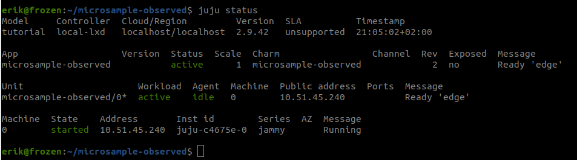

## Step 2 - Adding a config option.

Now that the charm deploys and install, lets add the configuration option which will controll the channel from which the snap is installed.

At the time of writing, Juju supports three types of options: "int", "string" and "bool".

Create a config.yaml file which looks like this:

    options:
    channel:
        type: string
        default: "edge"
        description: "Channel for microsample snap."

Update the _on_install funtion in charm.py to make use of the new config option:

```
    def _on_install(self, theevent):
        """Handle install event."""
        self.unit.status = ops.MaintenanceStatus("Installing microsample snap")
        channel = self.config.get('channel')
        if channel in ['beta', 'edge', 'candidate', 'stable']:
            os.system(f"snap install microsample --{channel}")
            self.unit.status = ops.ActiveStatus("Ready")
        else:
            self.unit.status = ops.BlockedStatus("Invalid channel configured.")
```

Now, pack the charm again and upgrade the application in the model. You will now see the config option in the settings section.

```
charmcraft pack

juju upgrade-charm microsample-observed --path=./microsample-observed_ubuntu-22.04-amd64.charm

juju config microsample-observed

application: microsample-observed
application-config:
  trust:
    default: false
    description: Does this application have access to trusted credentials
    source: default
    type: bool
    value: false
charm: microsample-observed
settings:
  channel:
    default: edge
    description: Channel for microsample snap.
    source: default
    type: string
    value: edge

```

Now, lets add code to act on the config-changed event.

Add the following the the __init__() function:

```self.framework.observe(self.on.config_changed, self._on_config_changed)```

Add the corresponding _on_config_changed() and lets also let us know something in the status message about the configuration:

```
    def _on_config_changed(self,theevent):
        channel = self.config.get('channel')
        if channel in ['beta', 'edge', 'candidate', 'stable']:
            os.system(f"snap refresh microsample --{channel}")
            self.unit.status = ops.ActiveStatus("Ready at '%s'" % channel)
        else:
            self.unit.status = ops.BlockedStatus("Invalid channel configured.")
```

Pack, upgrade and finally try change the channel:

```
juju config microsample-observed channel=beta
juju status
```
